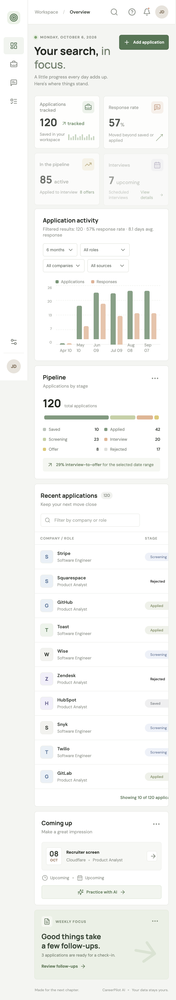
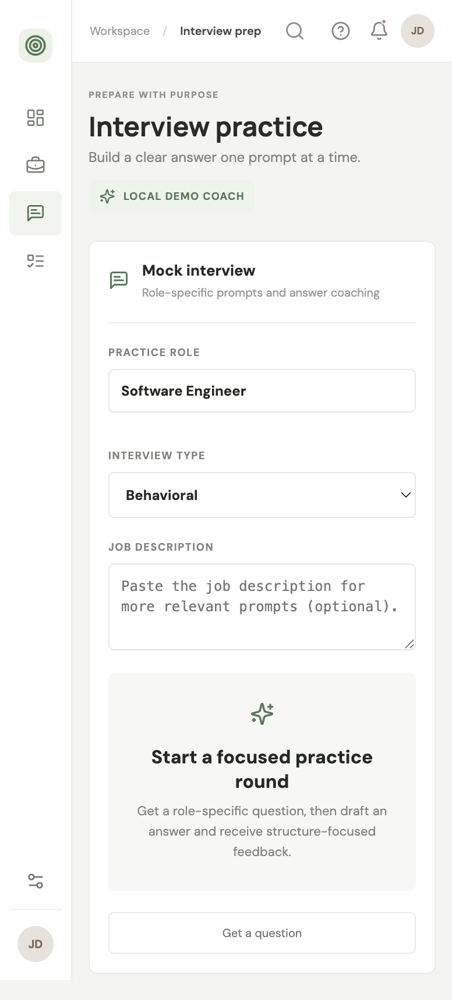

# CareerPilot AI

Job search, applications, and interview practice in one focused workspace.

## Stack

- Frontend: React, TypeScript, Vite
- API: Flask, SQLAlchemy
- Database: PostgreSQL
- Local orchestration: Docker Compose

## Run locally

Requirements: Node.js 20+, Python 3.11+, PostgreSQL 16+ (or Docker Desktop).

```bash
docker compose up --build
```

Optional single-user login: create a local `.env` from `.env.example`, set a unique `CAREERPILOT_PASSWORD` and `CAREERPILOT_SECRET_KEY`, then restart Compose. To enable the OpenAI-compatible coach, also set `AI_BASE_URL`, `AI_API_KEY`, and `AI_MODEL`; the key stays on the server. With no password configured, local development remains open. Never commit `.env` or paste API keys into chat.

Open the frontend at http://localhost:5173 and the API health endpoint at http://localhost:5001/api/health.

To run the frontend without Docker, use `cd frontend && npm install && npm run dev`. The Flask API can be run from `backend` with `python -m venv .venv`, `source .venv/bin/activate`, `pip install -r requirements.txt`, and `flask --app app run --debug`.

## Current functionality

- Dashboard metrics, pipeline breakdown, and application list backed by PostgreSQL
- 120 synthetic sample applications and interview records on first database startup
- Create, edit, archive/restore, and delete applications
- Store recruiter details, notes, salary, and follow-up dates; review follow-ups in Tasks & notes
- Filter analytics by date range, role, company, and source; response metrics use recorded response dates
- Optional single-user password login, disabled unless configured
- Behavioral, technical, role-specific, and case-study practice with a timer and optional job description
- OpenAI-compatible interview feedback when configured; otherwise clearly labeled local-demo feedback
- Practice answers are sent for feedback but are not retained

## Screenshots

The screenshots below show the responsive mobile dashboard and interview-practice workflow.

### Dashboard



### Interview practice



Run checks with `docker compose run --rm api pytest -q` and `cd frontend && npm test && npm run build`.

See [PLAN.md](PLAN.md) for remaining work. Seeded companies and application histories are synthetic, not real job applications. Before public deployment, configure TLS, production secrets, multi-user ownership, migrations, logging, backups, and deployment settings.
